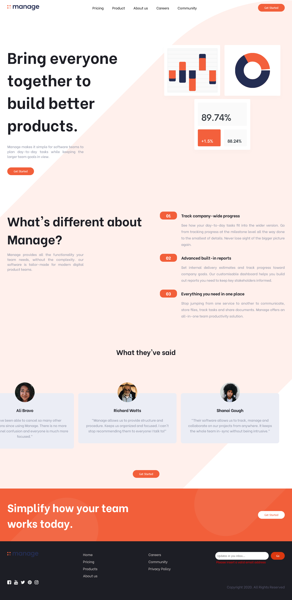
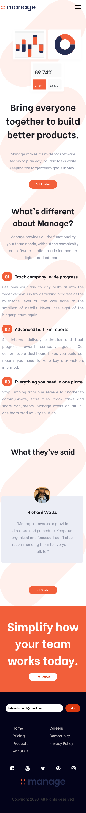

# Frontend Mentor - Manage landing page solution

This is a solution to the [Manage landing page challenge on Frontend Mentor](https://www.frontendmentor.io/challenges/manage-landing-page-SLXqC6P5). Frontend Mentor challenges help you improve your coding skills by building realistic projects. 

## Table of contents

- [Overview](#overview)
  - [The challenge](#the-challenge)
  - [Screenshot](#screenshot)
  - [Links](#links)
- [My process](#my-process)
  - [Built with](#built-with)
  - [What I learned](#what-i-learned)
  - [Continued development](#continued-development)
  - [Useful resources](#useful-resources)
- [Author](#author)
- [Acknowledgments](#acknowledgments)

## Overview

### The challenge

Users should be able to:

- View the optimal layout for the site depending on their device's screen size
- See hover states for all interactive elements on the page
- See all testimonials in a horizontal slider
- Receive an error message when the newsletter sign up `form` is submitted if:
  - The `input` field is empty
  - The email address is not formatted correctly

### Screenshot

### Links

- Solution URL: [Solution URl](https://github.com/BelayAdamu/Manage-landing-page.git)
- live site URL: [Live site](https://belayadamu.github.io/Manage-landing-page/)
## My process

### Built with

- Semantic HTML5 markup
- CSS custom properties
- Flexbox
- regExpressions
- fontawesome

### What I learned

In this project I practiced my Flexbox layout, regExpression, transitions and responsive design skills.

### Continued development

This is my first challange in which I practiced my js skills. the project involved very little js coding and I'm a bit dissapointed at that.
  
### Useful resources

- [W3Schools](https://www.w3schools.com/) - This site is the most important website out there for reference. Anyone can refer to this and not go anywere elese.
- [Stackoverflow](https://stackoverflow.com/) - This helps a lot if your codes have bugs. Practically, it has solutions for virtually every problem.

## Author

- Frontend Mentor - [@BelayAdamu](https://www.frontendmentor.io/profile/BelayAdamu)
- Facebook - [Belay Adamu](https://www.facebook.com/belay.adamu.96)
- Linkedin - [Belay Adamu](https://www.linkedin.com/in/belay-adamu-442b2614p)

## Acknowledgments

Fronend Mentor
Coursera 
W3schools 
